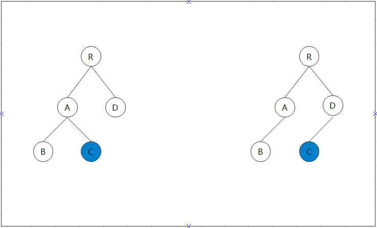

# 深入 React 原理

渲染 UI 离不开 DOM 操作，而频繁操作 DOM 难免导致项目性能变差，在这方面 React 提供了虚拟 dom 的优化工作。
要更新数据就先更新 DOM，再进行 dom-diff 操作，最后真正发生变化的数据渲染到真实 DOM 中。

## JSX

个人认为跟传统的 element 声明方式相比，JSX 语法利用了组件化的思想，将元素构建成了一个组件对象，然后再进行渲染。

## dom-diff

web 界面实质是一棵 DOM 树，当某一节点变化时，React 会对当前的 DOM 树和前一状态的 DOM 树进行比较，这个比较的算法就是本节讲述的 dom-diff 算法。

React 的 diff 算法的两个假设：

- React 认为相同类型的两个组件有类似的 DOM 树结构，在这种情况下会采用 diff 算法比较两个 DOM 树的哈衣。如果两个组件的类型不同，那么 React 会认为这两个 DOM 树结构不同，将之前的组件直接删除，然后创建新组件
- 同一层次的一组节点，可以通过唯一的 key 值来进行区分。

React 认为在 web UI 中 DOM 节点的跨层级移动操作比较少，所以只会比较同一父节点下的子节点。如果节点类型发生变化，那么 React 会将其删除，然后新建节点到新的 DOM 树上。

**在进行实际开发时，如果遇到同一层级的子节点进行操作时，需要加上 key 属性来进行唯一区别，来避免删除、创建等重复操作，减少性能消耗。**

通过一个具体例子来解释一下 React 的 dom-diff 算法。


C 节点从 A 节点转移到了 D 节点上，React 对整棵树的操作步骤为： 1.删除 C 节点 2.创建 C 节点 3.更新 B 节点 4.更新 A 节点 5.渲染 C 节点 6.更新 D 节点 7.更新 R 节点

## setState

React 中组件的更新靠的是内部 state 值的更新，对组件进行重新渲染离不开重新设置 state 属性，就得讲述一下修改 state 状态的方法 setState

setState 用法

```javascript
class Hello extends React.Component {
  constructor(props) {
    super(props)
    this.state = { isLiked: true }

    this.changeState = this.changeState.bind(this)
  }
  changeState() {
    this.setState({
      isLiked: !this.state.isLiked,
    })
  }
  render() {
    return <button onclick={this.state.changeState}>{this.state.isLiked ? '点赞' : '取消'}</button>
  }
}
```

setState 方法可以传入两个参数，格式如下：

```
setState(update,[callback])
//updater为新的state或props，既可以为一个对象，也可以是一个函数，[callback]为回调函数
```

setState 方法为异步操作，实质上是通过一个队列机制来更新 state，我们在上述例子中加入一些 log 日志来查看 setState 的状态。

```javascript
class Hello extends React.Component {
  constructor(props) {
    super(props)
    this.state = { isLiked: true }

    this.changeState = this.changeState.bind(this)
  }
  changeState() {
    console.log(this.state.isLiked)
    // true
    this.setState({
      isLiked: !this.state.isLiked,
    })
    console.log(this.state.isLiked)
    //true
  }
  render() {
    return <button onclick={this.state.changeState}>{this.state.isLiked ? '点赞' : '取消'}</button>
  }
}

//第一个log日志输出的值为true，然后执行setState方法，再出入第二个log日志
//如果setState方法为同步更新，那么第二个log日志处应该为false

// 但第二个log日志输出的值仍为true，这种反证法可以说明setState确实为异步操作方法
```

setState 原理
