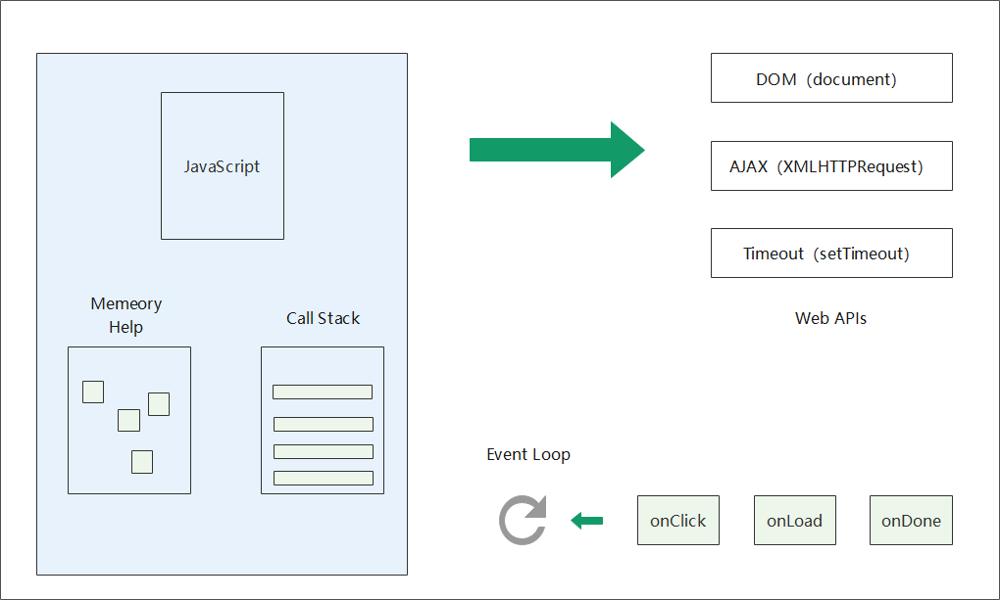
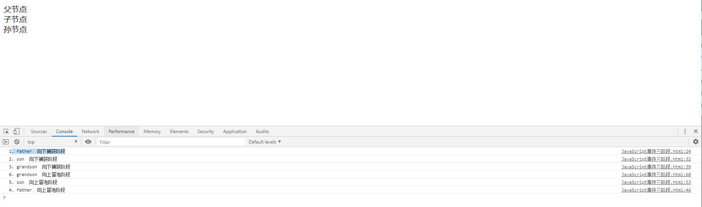
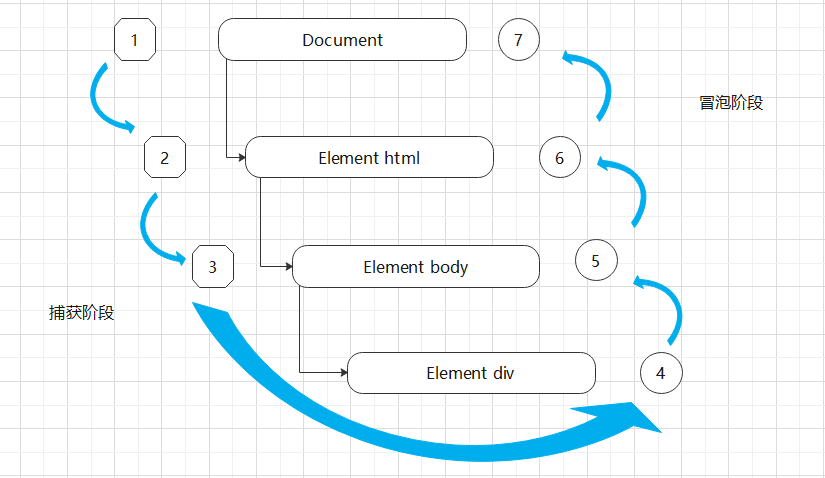

# 漫谈 React 事件系统

## JavaScript 事件机制

- 事件，可以理解为要做一件什么事情。
- 事件系统，是整个事件的所有处理系统。
  - 事件源：动作发生的初始点。
  - 事件对象：保存事件状态。
  - 事件处理：要做一件什么事情。

在前端项目中会有大量的 DOM 操作或者 IO 事件，为了避免出现阻塞现象，JavaScript 采用事件循环机制来解决这一问题。

[Event Loop](https://juejin.im/post/6844904202787880974)

```javascript
    fucntion f1(){
        console.log("1.主线程执行")
    }
    fucntion f2(){
        setTimeout((function(){
            console.log("2.先放入时间队列，等执行栈全部执行完后，执行该方法")
        }),100)
    }
    fucntion f3(){
        console.log("3.主线程执行")
    }

    f1()
    f2()
    f3()

    // 1.主线程执行
    // 3.主线程执行
    // 2.先放入时间队列，等执行栈全部执行完后，执行该方法
```


该图中，Web APIs 为一些异步操作，当 JavaScript 识别出异步方法时，会先将其放入 Callback Queue（这个事件队列中多数为回调函数，所以称为回调队列）中，Call Stack 中会先执行同步操作，等到 Call Stack 中的所有方法都执行完成后，Callback Queue 中等待的方法才会放入执行栈中执行。Memory Heap 中存放一些对象，但当一个内存区域的角色。

JavaScript 事件触发分为三个阶段：

- 事件捕获阶段：事件从文档的根节点触发，向其子节点延伸，遇到相同注册事件立即触发，直到目标节点为止。
- 事件处理阶段：事件到达目标节点，触发事件
- 事件冒泡阶段：事件离开目标节点返回到文档根节点，并在路途上遇到相同注册事件再次触发。

```
<!DOCTYPE html>
<html lang="en">
<head>
    <meta charset="UTF-8">
    <title>JavaScript事件三阶段</title>
</head>
<body>
<div id="myDivFather">
    父节点
    <div id="myDivSon">
        子节点
        <div id="myDivGrandson">
            孙节点
        </div>
    </div>
</div>
<script type="text/javascript">
    var f = document.getElementById('myDivFather');
    var s = document.getElementById("myDivSon");
    var g = document.getElementById("myDivGrandson")
    f.addEventListener("click",function () {
        console.log("1. father  向下捕获阶段");
    },true);

    s.addEventListener('click',function () {
        console.log("2. son  向下捕获阶段")
    },true);
    g.addEventListener('click',function () {
        console.log("3. grandson  向下捕获阶段");
    },true);
    f.addEventListener('click',function () {
        console.log("4. father  向上冒泡阶段")
    },false);
    s.addEventListener('click',function () {
        console.log("5. son  向上冒泡阶段")
    },false);
    g.addEventListener('click',function () {
        console.log("6. grandson  向上冒泡阶段");
    },false);
</script>
</body>
</html>

```

比如点击孙节点，显示结果为：



**addEventListener 方法的最后一个参数可以指定事件为捕获还是冒泡**



事件处理阶段，如果既注册了捕获事件，也注册了冒泡事件，这时候事件的执行是按照事件注册的先后顺序来的。

## 剖析 React 事件系统

在 React 的时间系统中，没有把所有事件绑定到对应的真实 DOM 上，而是使用委托机制实现了一个统一的事件监听器，把所有的事件绑定到了最外层 document 上，然后再将事件进行分发。

在合成事件中，React 提供了三种绑定事件的方法

- 组件上绑定
- 构造函数中绑定
- 箭头函数中绑定

组件上绑定事件

```javascript
class HelloWorld extends React.Component {
  constructor(props) {
    super(props)
  }
  showName() {
    alert('hello world!')
  }
  render() {
    return (
      <div>
        <button onclick={this.showName}>单击事件</button>
      </div>
    )
  }
}
// 在React中组件绑定事件，事件类型都为小写，且函数要放到引号里面。
```

在构造函数中绑定事件

```javascript
class HelloWorld extends React.Component {
  constructor(props) {
    super(props)
    this.showName = this.showName.bind(this)
  }
  showName() {
    alert('hello world!')
  }
  render() {
    return (
      <div>
        <button onclick={this.showName}>单击事件</button>
      </div>
    )
  }
}
// this指向本组件，在构造方法中声明时，一定要用bind()来绑定，传入this参数。
// 官方推荐使用该方式来绑定方法。
```

箭头函数绑定事件

```javascript
class HelloWorld extends React.Component {
  constructor(props) {
    super(props)
  }
  showName() {
    alert('hello world!')
  }
  render() {
    return (
      <div>
        <button onclick={() => this.showName()}>单击事件</button>
      </div>
    )
  }
}
```
