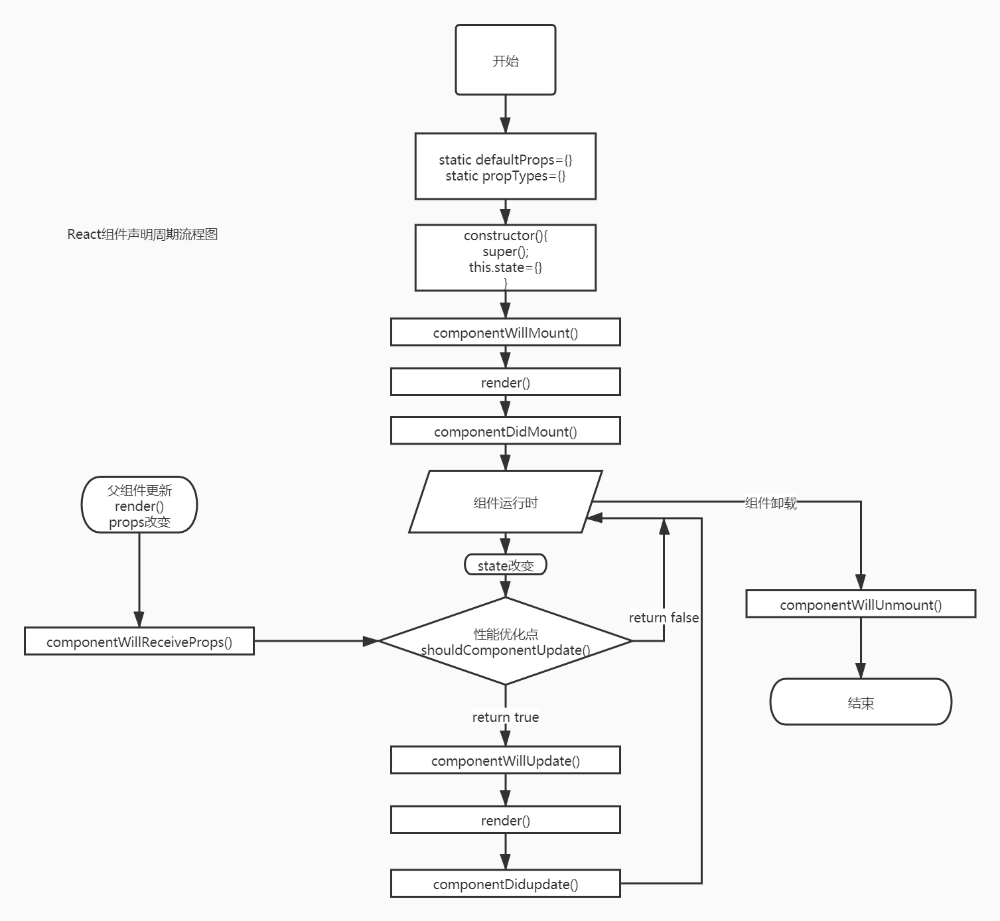

# React 组件

## 理解组件化思想

- React 的组件化思想，可以理解为把具有独立功能的 UI 部分进行了封装。
- 与 MVC 相比，React 是从功能的角度将 UI 封装成不同组件，整个页面的组成都是通过小组件构建成大组件的方式来实现。
  - 可组合性：定义了一个 UI 组建后，可以和其他组件进行并列或者嵌套使用
  - 可重用性: 定义后的组件功能是相对独立的，在不同的 UI 场景中，可以重复使用
  - 可维护性：每个组件的实现逻辑都仅限于自身，不涉及其他组件。

## 组件之间的通信

即组件之间的数据传递。

- 父子组件之间的通信
- 同级组件之间的通信

#### props

是 properties 的简称，范围为属性。可以作为一个参数传入，旨在将任意类型的数据传给组件。

props 简单使用

```javascript
    <div id="root"></div>
    ...
    ...
    // 定义React组件要用大驼峰法，且首字母要大写。
    class SayName extends React.Component{
        render(){
            return(
                <h1>{this.props.name}</h1>
            )
        }
    }
    ReactDOM.render(
        <SayName name="harrison" />,
        document.getElementById('root')
    )
```

props 可以在挂载组件的时候设置初始值

```javascript
class SayName extends React.Component {
  static defaultProps = {
    name: 'harrison',
  }
  render() {
    return <h1>{this.props.name}</h1>
  }
}
ReactDOM.render(<SayName />, document.getElementById('root'))
```

pros 一般不允许更改，所以这里用 static 关键字来定义默认的 props 值，在 ES5 中初始化 props 使用 getDefaultProps 方法来实现，在 ES6 中统一使用 static 类型来定义。

#### state

state 为状态之意，组件在 React 中可以理解为是一个状态机，组件的状态就是通过 state 来来记录的。
相对 props 来说，state 是用在组件内部并且是可以修改的。

state 基本操作包括初始化、读取和更新。

通过 state 实现改变 DOM 元素颜色

```javascript
    <div id="root"></div>
    ...
    ...
    class ChangeColor extends React.Component{
        constructor(props){
            super(props)
            this.state = {isRed:true}
            this.handleClick = this.handleClick.bind(this)
        }
        handleClick(){
            this.setState((prevState,props)=>{
                isRed:!prevState.isRed
            })
        }
        render(){
            var redStyle={
                color:"red"
            }
            var blueStyle={
                color:"blue"
            }
            return(
                <div>
                    <h1 style={this.state.isRed? redStyle:blueStyle}></h1>
                    <button onClick={this.handleClick}>改变颜色</button>
                </div>
            )
        }
    }
    ReactDOM.render(
        <ChangeColor />,
        document.getElementById('root')
    )
```

setState 方法有两个参数，官方给出的说明如下：

```
void setState(
    function|object nextState,
    [function callback]
)
```

第一个参数表示的是要改变的 state 对象，第二个参数是一个回调函数，这个回调函数是在 setState 的异步操作执行完成并且组件已经渲染后执行的，所以可以通过该放方法获取之前的状态值 prevState。

#### 父子组件通信

组件通信之间有一个概念叫做数据流：在 React 中，数据流是单向的，通过 props 从父节点传递到子节点，如果父节点的 props 发生改变，则 React 会遍历整棵组件数，从而渲染用到这个 props 的所有组件。

#### 子父组件通信

#### 同级组件通信

## 组件生命周期

React 的生命周期严格分为三个阶段：

- 挂载期（实例化期）：一个组件实例初次被创建的过程
- 更新期（存在期）：组件在创建猴再次渲染的过程
- 卸载期（销毁期）：组件在使用完后被销毁的过程。

#### 组件的挂载

挂载期有一些方法会被依次出发，列举如下：

- constructor
- getInitialState
- getDefaultProps
- componentWillMounet
- render
- componentDidMount

#### 组件的更新

React 在生命周期中的更新过程包括：

- componentWillReceiveProps
- shouldComponentUpdate
- componentWillUpdate
- componentDidUpdate

#### 组件的卸载

该过程主要涉及一个方法即

- componentWillUnmount
  当组件从 DOM 树删除的时候调用该方法

#### 总览组件生命周期


